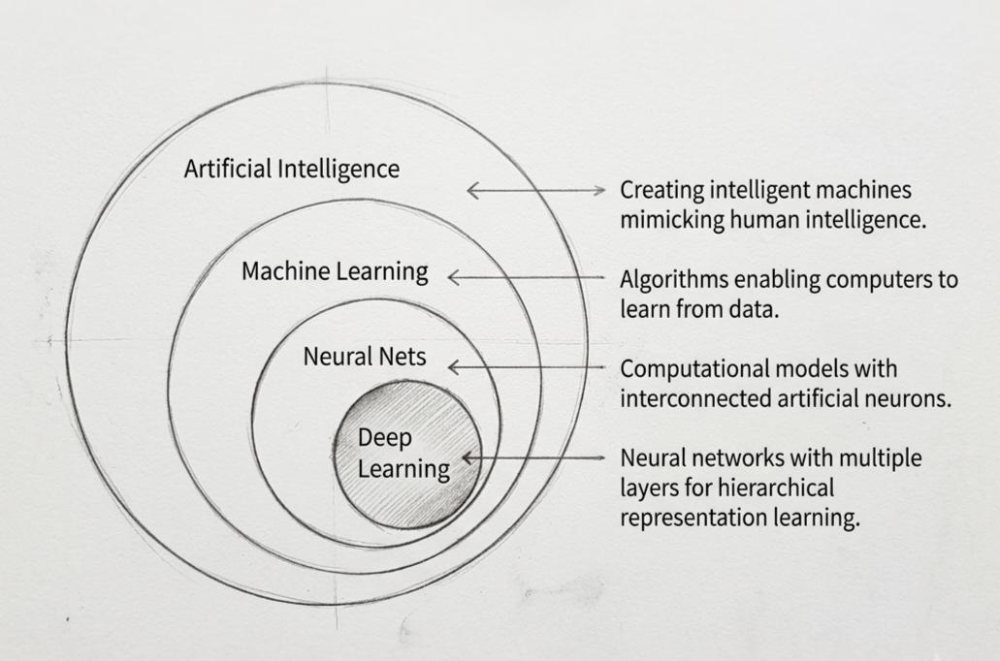

# 🤖 Machine Learning Overview

**Machine Learning (ML)** is a branch of artificial intelligence (AI) focused on building systems that learn from data to improve their performance without explicit programming.

ML algorithms discover underlying patterns using statistics and probability within training data to make autonomous predictions or decisions on completely new, unseen information.

---

## 🧠 The Need for Machine Learning

Traditional software development relies heavily on explicit, rule-based instructions. While effective for straightforward tasks, this approach falls short when tackling intricate problems or processing massive, high-dimensional datasets.

Machine Learning solves this problem by automatically discovering patterns and relationships from data. ML models adapt to new inputs and generate accurate predictions—all without programming for every possible scenario.

---

## 🏢 Top Industries Leveraging ML

| Industry | Current Deployment Level | Core Application | Long-term Impact |
| :--- | :--- | :--- | :--- |
| Finance (BFSI) | **Highest** (20% share) | Fraud detection & automated credit risk scoring | Global financial transaction security and market efficiency |
| Healthcare | **Fastest Growth** (14% share) | AI diagnostics, image analysis, & molecular drug discovery | Eradication of diseases via highly personalized preventative medicine |
| Automotive | **High** (16% share) | Sensory fusion processing for autonomous driving systems | Completely driverless commercial fleets and public transit infrastructure |
| Retail & E-commerce | **Steady** (13% share) | Hyper-personalized recommenders & dynamic predictive pricing | 10–15% revenue lift via zero-waste, predictive supply chains |
| Manufacturing | **Rapidly Scaling** (12% share) | Predictive maintenance & automatic vision quality checks | Fully autonomous "dark factories" running 24/7 without manual intervention |

---

## ⚙️ The Machine Learning Pipeline

A standard ML pipeline follows six structured phases—from raw data collection to live deployment.

---

### 1. 📥 Data Ingestion (Gathering the Data)

Before a model can learn, it requires raw information.

- **Sources:** Databases, APIs, IoT sensors, or flat files (e.g., CSV, JSON, logs).
- **Formats:** Can be highly structured (relational tables, spreadsheets) or completely unstructured (raw audio, images, free-form text).

---

### 2. 🧹 Data Preprocessing (Cleaning It Up)

Real-world data is notoriously messy. It must be scrubbed before an algorithm can process it effectively.

- **Handling missing values:** Removing incomplete rows or imputing gaps with statistical averages.
- **Removing noise:** Filtering out duplicate entries, corrupted records, and obvious human errors.
- **Encoding categorical variables:** Converting non-numeric labels (e.g., `True/False`, `Red/Blue`) into numerical representations (e.g., `1/0`, one-hot vectors)—since algorithms only operate on mathematics.

---

### 3. 🔧 Feature Engineering (Picking the Right Variables)

*Features* are the specific attributes (columns) the model uses to make decisions. Thoughtful feature engineering significantly boosts performance.

- **Feature selection:** Discarding irrelevant columns (e.g., a customer's internal `UserID` rarely helps predict purchasing behavior).
- **Feature scaling:** Normalizing or standardizing numerical ranges—for instance, compressing wide price bands into a uniform `[0,1]` scale so no single feature dominates.
- **Feature creation:** Combining existing columns to construct stronger predictive indicators (e.g., deriving `BMI` from `Height` and `Weight`).

---

### 4. 🧮 Model Training (The Math Phase)

This is where the actual pattern discovery occurs. The dataset is typically split—roughly **80%** for training and **20%** for later validation.

- **Initial guess:** The algorithm starts with random mathematical weights applied to the training data.
- **Loss calculation:** A *loss function* quantitatively measures how far the current guess deviates from the ground truth.
- **Optimization (backpropagation/gradient descent):** The system iteratively adjusts its internal parameters to minimize that error. This loop repeats thousands (or millions) of times until the predictions converge to optimal accuracy.

---

### 5. 📊 Evaluation (Testing It Out)

We must prove the model has genuinely *learned* underlying patterns—not just memorized the training set.

- **The final exam:** The held-out **20%** test set—data the model has never encountered—is fed through the trained system.
- **Performance metrics:** Success is measured using rigorous statistical measures such as overall accuracy, precision, recall, F1-score, or mean squared error (depending on the task).

---

### 6. 🚀 Deployment & Monitoring (Going Live)

Once the model passes evaluation, it is ready for real-world integration.

- **Launch:** The model is packaged and deployed into a live application, API endpoint, or cloud service.
- **Inference (making predictions):** Live, user-generated data streams into the system, and the model instantly outputs decisions—e.g., flagging a credit card swipe as potentially fraudulent in milliseconds.
- **Continuous monitoring:** Performance is actively tracked over time. If real-world data drifts or trends shift (concept drift), the model's accuracy may degrade—triggering alerts for retraining or fine-tuning.

---

## 🌟 The Pros & Cons of Machine Learning

### Benefits (Why it's so powerful)

- **Smart Automation:** Instead of writing rigid, line-by-line code for every scenario, ML creates systems that can make decisions entirely on their own.
- **Tailored Experiences:** It quickly analyzes past user behavior to figure out exactly what people want, delivering highly accurate product or content recommendations.
- **Finding Hidden Connections:** ML can easily spot complex trends and patterns in massive data piles that a human analyst would completely miss.
- **Always Getting Better:** The models are dynamic. As new data flows in, the system automatically updates and improves its own accuracy.
- **Handling Massive Scale:** It can chew through gigabytes of live data instantly, allowing systems to make split-second decisions in real-time.

---

### ⚠️ Challenges (What makes it difficult)

- **"Garbage In, Garbage Out":** A model is only as good as its data. If train it on incomplete, messy, or incorrect data, the predictions will be useless.

- **Expensive & Power-Hungry:** Training advanced models isn't cheap. It requires heavy-duty hardware (like specialized GPUs) and consumes a massive amount of electricity.

- **The "Black Box" Problem:** Deep neural networks are incredibly complex. Often, they give a highly accurate answer, but human engineers can't easily explain how the machine arrived at that conclusion.
- **Inheriting Human Bias:** Machines aren't naturally neutral. If the historical data used to train the model contains human prejudices, the AI will simply learn and repeat that discrimination.
- **Becoming Outdated (Model Drift):** Real-world trends change constantly. If a model isn't regularly updated, its predictions will slowly lose accuracy as people's behaviors shift away from the original data.
